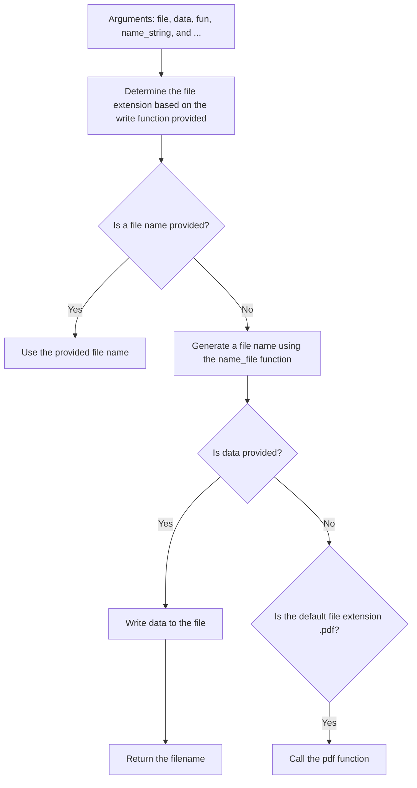

# Instructions in PICASSO\scRNA_analysis\utils.R

## ## Before all the functions

1. Define `work_dir` and `project_name`

like

```R
work_dir <- "/public/home/luoliheng/yujia/analysis/gz+jz/re_analysis_jz/"
project_name <- "MSC"
```

2. Source the script and use all scripts in this PICASSO\scRNA_analysis


```R
source("/public/home/luoliheng/SINGLE/scRNA_analysis/utils.R", chdir = TRUE)
# The output will help you to manage your project
[1] "This scripts is in: /public/home/luoliheng/SINGLE/scRNA_analysis"
[1] "Your work directory is in: /public/home/luoliheng/yujia/analysis/gz+jz/re_analysis_jz/"
[1] "Your project name is: MSC"
```


## save_file


```R
# EXAMPLE


save_file(fun = pdf, name_string = "before_qc")

```





```mermaid

```
