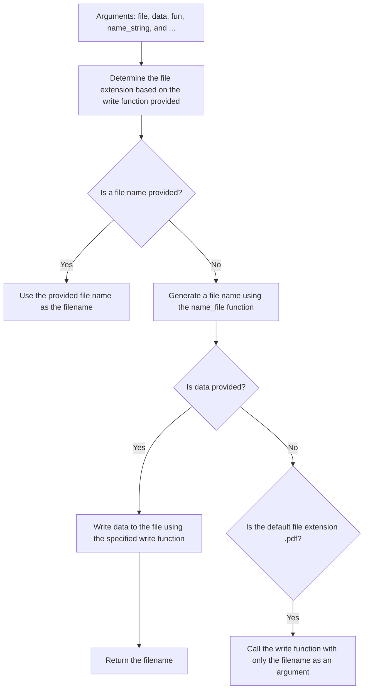

# Functions in PICASSO\scRNA_analysis\utils.R

## save_file


```mermaid
graph TD
A[Arguments: file, data, fun, name_string, and ...] --> B[Determine the file extension based on the write function provided]
B --> C{Is a file name provided?}
C -->|Yes| D[Use the provided file name as the filename]
C -->|No| E[Generate a file name using the name_file function]
E --> F{Is data provided?}
F -->|Yes| G[Write data to the file using the specified write function]
F -->|No| H{Is the default file extension .pdf?}
H -->|Yes| I[Call the write function with only the filename as an argument]
G --> J[Return the filename]
```


```R

```


```mermaid

```
